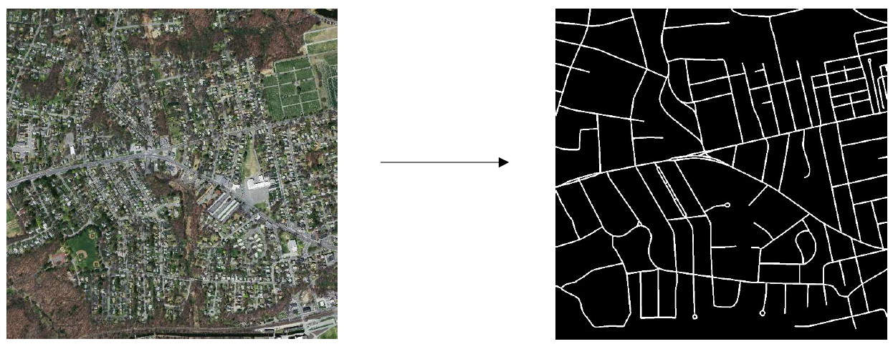
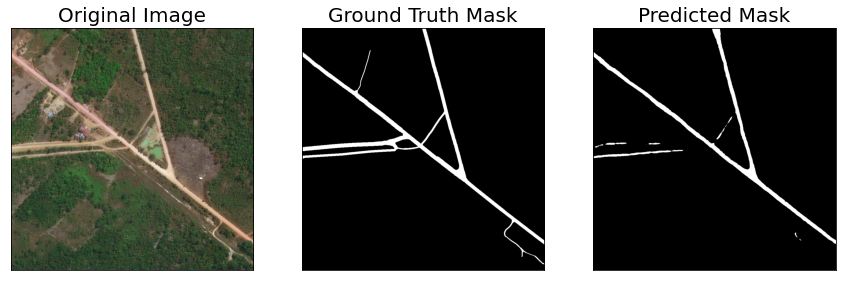
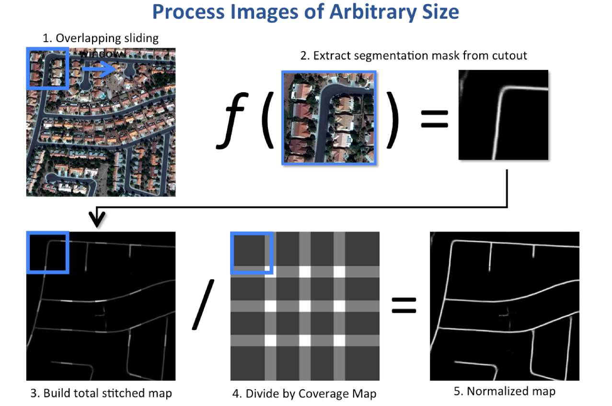

# Semantic-Segmentation-of-Roads
Recruitment Project for 2nd Year
## Problem Statement

While using GPS mapping services like Google Maps, one might observe that they are able to mark out where roads or travelable paths are located on the map. The proposed problem is similar: Given an image taken by satellite, segment out road pixels from those that aren’t roads (for e.g., pixels that include buildings, trees, water bodies etc). The aim shall be to classify individual pixels to generate a black-and-white binary mask for the original image, depicting roads with white pixels and everything else in black. This problem is known as <b>Semantic Segmentation</b> in the domain of Computer Vision.

## Solution
We used __DeepLabV3+__ model to [segment out road pixels from non-road pixels](./code/model_training.ipynb).
### Dataset used: 
The dataset that we used to train and validate the model is [__Massachusetts Roads Dataset__](https://www.cs.toronto.edu/~vmnih/data/). 

<h4>
Sample Image-Mask Pair
</h4>

Since the images were quite large (about 1500 pixels x 1500 pixels), to get better segmentation results, the dataset was <a href="./code/ML_dataset_processing.ipynb">preprocessed</a> before training. We cut the images to a smaller size (256 pixels x 256 pixels, segmented out the roads for these new smaller images and finally stitched back the output masks that we got.

### Model used: 
The architecture of __DeepLabV3+__ looks like: 

<h4>
<a href="https://arxiv.org/abs/1802.02611">Image Source: DeepLabV3+ [Liang-Chieh Chen et al.]</a>
</h4>

## Results
The results produced were like:

## Summary
The overall process can be summarised as:

## Mentor: 
- Shrashtika Singh

## Team Members:
- Apurba Prasad Padhy
- Ayushi Raj
- Tushar Sahu